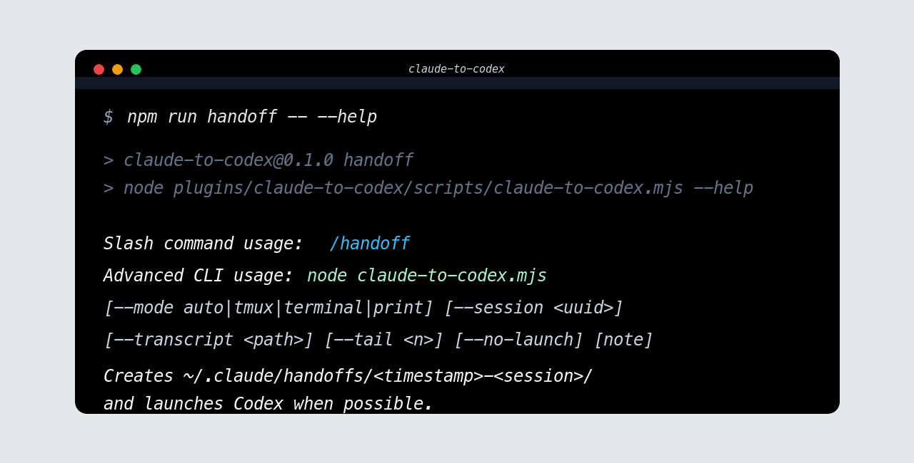
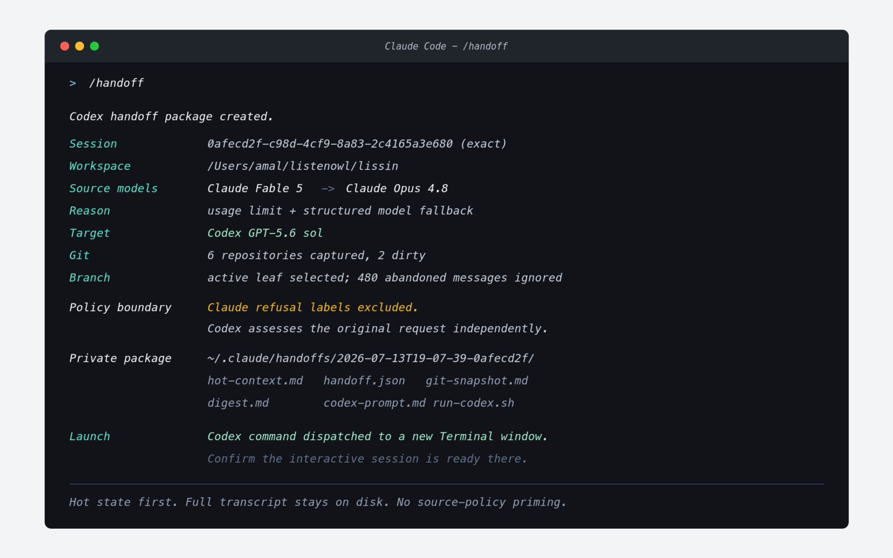

# Claude to Codex

[](https://github.com/Amal-David/claude-to-codex/actions/workflows/test.yml)
[](LICENSE)
[](https://skills.sh/amal-david/claude-to-codex)


**Switch from Claude Code to Codex without losing context.** Claude to Codex adds one `/handoff`
command that carries the active session into an interactive Codex terminal.

It selects the exact active conversation branch, detects model changes such as Fable 5 falling back
to Opus 4.8, writes private hot context, captures one repository or a multi-repository workspace,
resolves the configured Codex model, and dispatches Codex with a bounded pointer prompt. Fable is
treated as a Claude model, not as a separate agent.

## Why

Claude Code can run into context pressure or account limits during long engineering sessions. A session can also change models midstream, including from `claude-fable-5` to `claude-opus-4-8`. Codex is often the right continuation surface: it can open an interactive terminal UI, inspect the same repo, run commands, edit files, and spawn subagents when explicitly asked.

Claude to Codex is built around one principle:

> Put durable context on disk, put only hot state plus pointers in the Codex prompt, and make Codex verify current state before acting.

When a Fable session has fallen back and Codex is configured for GPT-5.6, `/handoff` makes that transition explicit:

```text
- Source models: Claude Fable 5 -> Claude Opus 4.8
- Handoff reason: Usage-limit signals were detected; the latest Claude model transition was Claude Fable 5 -> Claude Opus 4.8.
- Target model: GPT-5.6 sol (/Users/me/.codex/config.toml)
```

No extra slash-command arguments are required. Target model resolution is, in order: `--codex-model`,
`CLAUDE_TO_CODEX_MODEL`, the top-level model in `~/.codex/config.toml`, then the Codex default.

Source-model safety, legality, and refusal verdicts are deliberately not transferred as guidance.
Codex receives the user's actual request and independently decides whether to comply, safeguard, or
refuse under its own policies. Ordinary engineering blockers such as missing credentials remain in
the handoff as untrusted operational context.

## Screenshots





## Install

Prerequisites:

- Claude Code installed and authenticated.
- Codex CLI installed, on `PATH`, and authenticated with `codex login`.
- Node.js 22 or newer.
- Optional: tmux for same-terminal-pane workflows, or macOS Terminal for new-window launch fallback.

### Option A: Skills.sh

Install the self-contained skill globally for Claude Code:

```bash
npx skills add Amal-David/claude-to-codex --global --agent claude-code --skill handoff --yes
```

Then restart Claude Code and run:

```text
/handoff
```

See the public listing at [skills.sh/amal-david/claude-to-codex](https://skills.sh/amal-david/claude-to-codex).

### Option B: standalone `/handoff`

This gives the shortest command name.

```bash
git clone https://github.com/Amal-David/claude-to-codex.git
cd claude-to-codex
npm run install:standalone
```

Then restart Claude Code and run:

```text
/handoff
```

### Option C: Claude Code plugin

Use this when sharing with a team or installing from a marketplace.

```text
/plugin marketplace add https://github.com/Amal-David/claude-to-codex
/plugin install claude-to-codex@claude-to-codex
```

Plugin commands are namespaced:

```text
/claude-to-codex:handoff
```

For local development without marketplace install:

```bash
claude --plugin-dir /path/to/claude-to-codex/plugins/claude-to-codex
```

Plugin users who need advanced recovery flags should keep a local checkout and explicitly select a
session or opt into newest-session recovery:

```bash
cd /path/to/claude-to-codex
npm run handoff -- --mode print --latest
```

## Usage

The slash command is intentionally zero-argument. That keeps Claude Code from injecting free-form
slash-command text into a shell command.

```text
/handoff
```

If installed as a plugin, use the namespaced command:

```text
/claude-to-codex:handoff
```

Advanced controls are available through the direct Node CLI:

Standalone install path:

```bash
node ~/.claude/skills/claude-to-codex/scripts/claude-to-codex.mjs --mode print --latest
node ~/.claude/skills/claude-to-codex/scripts/claude-to-codex.mjs --mode tmux --latest
node ~/.claude/skills/claude-to-codex/scripts/claude-to-codex.mjs --mode terminal --latest
node ~/.claude/skills/claude-to-codex/scripts/claude-to-codex.mjs --latest --codex-model gpt-5.6-sol
node ~/.claude/skills/claude-to-codex/scripts/claude-to-codex.mjs --latest --handoff-reason usage-limit
node ~/.claude/skills/claude-to-codex/scripts/claude-to-codex.mjs --session 0afecd2f-c98d-4cf9-8a83-2c4165a3e680
node ~/.claude/skills/claude-to-codex/scripts/claude-to-codex.mjs --transcript ~/.claude/projects/-Users-me-project/session-id.jsonl
node ~/.claude/skills/claude-to-codex/scripts/claude-to-codex.mjs --latest --tail 80
node ~/.claude/skills/claude-to-codex/scripts/claude-to-codex.mjs --check
node ~/.claude/skills/claude-to-codex/scripts/claude-to-codex.mjs --latest --no-launch
node ~/.claude/skills/claude-to-codex/scripts/claude-to-codex.mjs --latest --codex-subagents 3 "review efficiency and usability before continuing"
```

Plugin or repo-checkout path:

```bash
cd /path/to/claude-to-codex
npm run handoff -- --mode print --latest
CLAUDE_TO_CODEX_MODEL=gpt-5.6-sol npm run handoff -- --latest
npm run handoff -- --latest --codex-model gpt-5.6-sol
npm run handoff -- --latest --handoff-reason usage-limit
npm run handoff -- --session 0afecd2f-c98d-4cf9-8a83-2c4165a3e680
npm run handoff -- --transcript ~/.claude/projects/-Users-me-project/session-id.jsonl
npm run handoff -- --latest --tail 80
npm run handoff -- --check
npm run handoff -- --latest --no-launch
npm run handoff -- --latest --codex-subagents 3 "review efficiency and usability before continuing"
```

Modes:

- `auto`: prefer a new tmux window, then a new macOS Terminal window, then print the command.
- `tmux`: force a tmux window.
- `terminal`: force a macOS Terminal window.
- `print`: write the handoff package and print the exact `sh .../run-codex.sh` command.

Useful recovery options:

- `--codex-model <id>`: pin the Codex continuation model, for example `gpt-5.6-sol` (`--model` remains an alias).
- `--handoff-reason <reason>`: override automatic classification with `usage-limit`, `model-change`, `context-pressure`, or `manual` (`--reason` remains an alias).
- `--session <uuid>`: use a specific Claude session id.
- `--transcript <path>`: use an exact Claude JSONL transcript path when automatic detection fails.
- `--latest`: explicitly choose the newest project transcript when no exact session id is available.
- `--tail <n>`: include 3 to 200 recent turns/tool uses in the digest.
- `--check`: validate Node, Codex, git, transcript discovery, handoff write access, and launch helpers.
- `--no-launch`: write the handoff package and print the command without opening tmux or Terminal.
- `--help`: show command help.

Developer/test options:

- `--cwd <path>`: override the workspace root used in the generated Codex command.
- `--handoff-root <path>`: override where handoff packages are written.

## What gets written

Each handoff creates:

```text
~/.claude/handoffs/<timestamp>-<session>/
|-- hot-context.md
|-- git-snapshot.md
|-- digest.md
|-- handoff.json
|-- codex-prompt.md
`-- run-codex.sh
```

The prompt points Codex to:

- the current workspace
- hot working context: current goal, touched files, decisions, constraints, dead ends, verification signals, and next action
- a continuation contract: Fable/Opus model lineage, detected handoff reason, and resolved Codex target model
- a capped git snapshot: branch, HEAD, status, changed files, warnings, and diff stats for one repo or immediate child repos in an orchestration workspace
- a machine-readable manifest: paths, options, transcript metadata, git metadata, artifact pointers, and preservation policy
- pointer-only project artifacts such as `AGENTS.md`, `CLAUDE.md`, `README.md`, package scripts, docs, workflows, and test config
- the Claude JSONL transcript
- the compact digest
- optional user note
- a policy-neutral continuation boundary and explicit verification instructions

## Recovery

If nothing opens, the command still prints a manual fallback:

```bash
sh ~/.claude/handoffs/<timestamp>-<session>/run-codex.sh
```

If transcript detection fails, rerun with either:

Standalone install path:

```bash
node ~/.claude/skills/claude-to-codex/scripts/claude-to-codex.mjs --session <uuid>
node ~/.claude/skills/claude-to-codex/scripts/claude-to-codex.mjs --transcript /absolute/path/to/session.jsonl
```

Plugin or repo-checkout path:

```bash
cd /path/to/claude-to-codex
npm run handoff -- --session <uuid>
npm run handoff -- --transcript /absolute/path/to/session.jsonl
```

If Codex is not found or not authenticated, install Codex and run:

```bash
codex login
```

For a broader diagnostic, run:

```bash
npm run handoff -- --check
```

## Repository layout

```text
plugins/claude-to-codex/         Claude Code plugin
assets/screenshots/              README screenshots
standalone/                      Files installed for short /handoff command
scripts/install-standalone.mjs   Installer for standalone mode
docs/                            Architecture, install, subagent, token notes
examples/codex-agents/           Optional Codex custom agent examples
test/fixtures/                   Test Claude JSONL transcript
```

## Docs

- [Architecture](docs/architecture.md)
- [Installation and distribution](docs/install.md)
- [Subagents](docs/subagents.md)
- [Token efficiency](docs/token-efficiency.md)
- [Releases](docs/releases.md)
- [Claude Code notes](docs/claude-code.md)
- [Codex notes](docs/codex.md)
- [References](docs/references.md)

## Verification

```bash
npm test
```

`npm test` is local-only and does not launch Codex. It verifies:

- Node syntax for the launcher, installer, validator, and smoke tests.
- Plugin and standalone command safety: no raw `$ARGUMENTS`, model invocation disabled, expected install paths.
- Handoff package shape: `hot-context.md`, `git-snapshot.md`, `digest.md`, `handoff.json`, `codex-prompt.md`, and `run-codex.sh`.
- Manifest contract: schema version, paths, options, transcript metadata, git metadata, artifact pointers, and structured signal groups.
- Continuation contract: Fable 5 to Opus 4.8 lineage, usage-limit classification, and GPT-5.6 target propagation into the runner.
- Zero-argument model resolution from Codex config, matching the real `/handoff` path.
- Secret redaction in the prompt, hot context, git snapshot, and manifest, including cloud credential env vars and AWS key IDs.
- Policy neutrality: source-model refusal metadata and safety verdicts are excluded, while factual operational blockers remain available as untrusted context.
- Git edge cases: normal repo, multi-repository workspace, non-git directory, and dirty worktree warning.
- Private package permissions: `0700` directory/runner and `0600` context files.
- Streaming JSONL analysis, malformed-line warnings, safe session identifiers, and workspace paths containing spaces.
- Runner validity with `sh -n` on the portable POSIX-shell script.
- `--check` diagnostics with an explicit fixture transcript.

Run the diagnostic you would give a real user:

```bash
npm run handoff -- --check
```

Run a no-launch handoff against the fixture and inspect the generated package:

```bash
tmpdir="$(mktemp -d)"
npm run handoff -- \
  --mode print \
  --transcript test/fixtures/sample-session.jsonl \
  --cwd "$PWD" \
  --handoff-root "$tmpdir" \
  --tail 6
find "$tmpdir" -maxdepth 2 -type f | sort
```

Expected files:

```text
codex-prompt.md
digest.md
git-snapshot.md
handoff.json
hot-context.md
run-codex.sh
```

Before cutting a release, also run:

```bash
npm pack --dry-run
```

## Security

Claude to Codex never needs cloud credentials. It reads local Claude transcript files under
`~/.claude/projects`, writes local handoff packages under `~/.claude/handoffs`, and launches local
processes such as `codex`, `tmux`, or macOS Terminal. Install it only from a repo you trust.

Handoff directories and runners are written with `0700` permissions; context files use `0600`.
Common API key, cloud credential, bearer token, and credential-bearing URL shapes are redacted, but
transcripts can still contain sensitive material. Treat `~/.claude/handoffs` like any other local
agent log directory. Git capture is capped and never includes full diffs by default. The Codex argv
contains only a bounded pointer prompt, not the digest or user note. Source-model policy verdicts are
excluded from continuation summaries rather than converted into advice for Codex.

The npm package is marked private to avoid colliding with an unrelated registry name. Releases are
distributed through GitHub source, plugin marketplace metadata, and SHA-256 checksum artifacts.

## License

MIT
